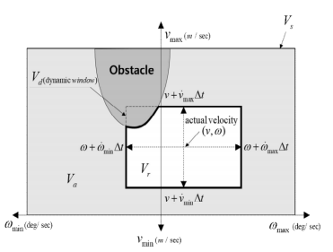
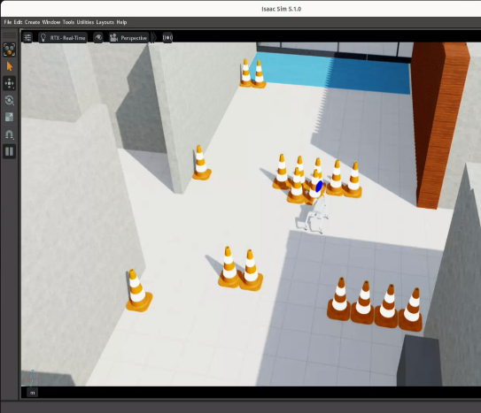
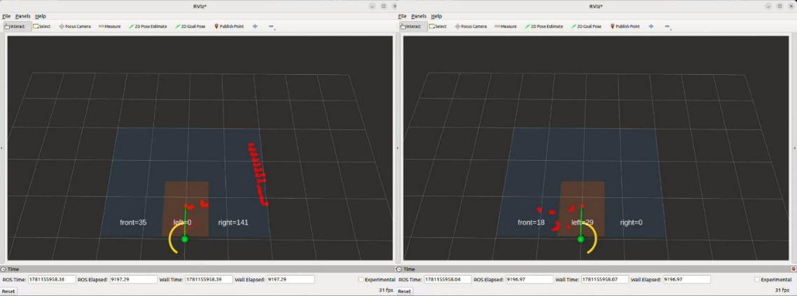
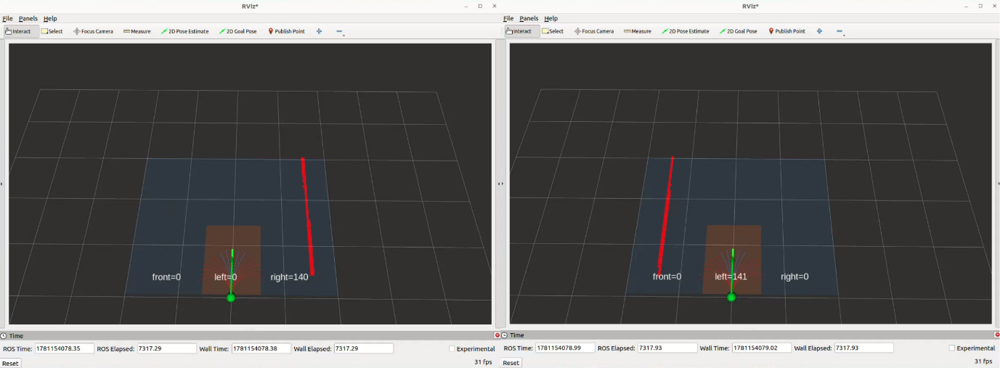
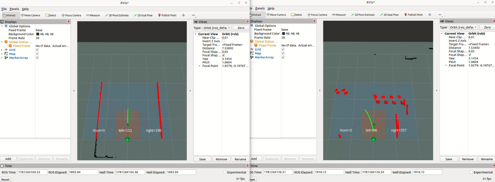
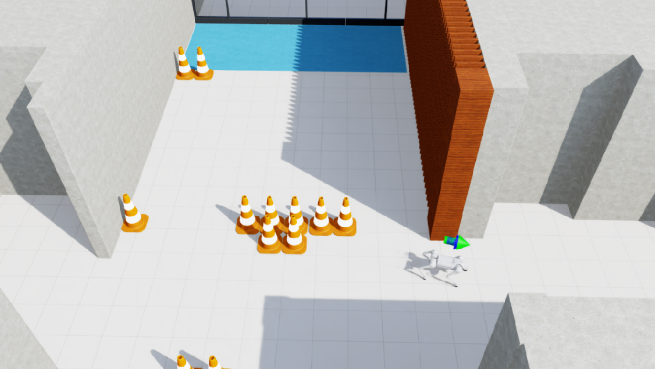
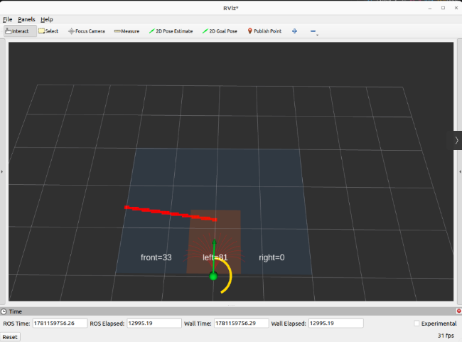
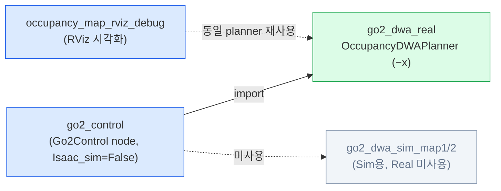
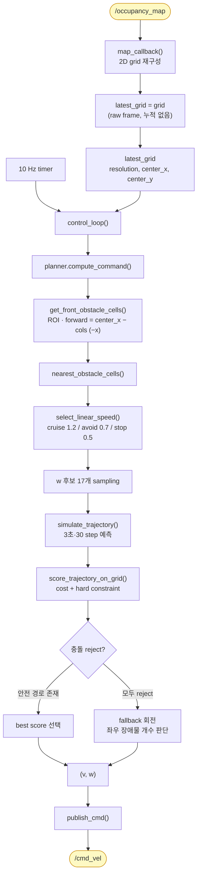

# Project 1 — Unitree Go2 DWA 주행 (Real)

> **Design and Manufacturing of Robotic systems — Term Project 1 Final report**
> 2026 · 주재영
>
> 이 브랜치(`go2-real`)는 **실제 Go2 하드웨어(Real)** 주행 코드입니다.
> 시뮬레이션(Isaac Sim) 코드는 [`go2-sim`](../../tree/go2-sim) 브랜치를 참고하세요.

---

## 목차
1. [서론](#1-서론)
2. [본론](#2-본론)
3. [결과](#3-결과)
4. [결론](#4-결론)
5. [코드 구조 및 실행](#5-코드-구조-및-실행)
6. [코드 흐름 그래프](#6-코드-흐름-그래프)
7. [참고문헌](#참고문헌)

---

## 1. 서론

로봇 알고리즘 개발에서 시뮬레이션은 실제 장비를 반복적으로 사용하지 않고도 알고리즘을 빠르게
검증할 수 있다는 장점이 있다. 그러나 실제 환경에서는 센서 노이즈, 통신 지연, 지면 조건, 로봇의
동역학적 반응 등이 시뮬레이션과 다르게 나타나기 때문에, 시뮬레이션에서 안정적으로 동작한 코드가
실물 로봇에서 동일하게 동작하지 않는 **Sim-to-Real Gap**이 발생할 수 있다.

본 프로젝트는 4족 보행 로봇 **Unitree Go2**를 대상으로, NVIDIA Isaac Sim 기반 Simulation 환경과
실제 Real 환경에서 장애물 회피 주행을 수행하고 두 환경의 동작 차이를 분석하는 것을 목표로 한다.
주행에는 occupancy map을 입력으로 받아 장애물 위치를 판단하고, 여러 속도 후보 중 가장 적절한
선속도와 각속도를 선택하는 **DWA(Dynamic Window Approach)** 기반 local planner를 사용하였다.

본 보고서에서는 DWA 알고리즘의 선정 이유와 구현 방식, Simulation과 Real 환경에서 다르게 조정한
코드 요소, 그리고 두 환경에서 발생한 결과 차이를 정리한다. 이를 통해 Go2 주행에서 발생한
Sim-to-Real Gap의 원인을 분석하고, 향후 이를 줄이기 위한 개선 방향을 제시하고자 한다.

## 2. 본론

### 2.1 실험 환경 및 코드 구조

사용한 플랫폼은 Unitree Go2이며, 주행은 Simulation 환경과 Real 환경에서 각각 수행하였다.
Real 환경에서는 실제 Go2와 노트북을 ROS2로 연결하여 주행하였다. `/occupancy_map` 토픽을 입력으로
받고, 계산된 속도 명령을 `/cmd_vel` 토픽으로 발행한다.

로봇의 절대 위치와 Goal point는 사용하지 않았으며, GPS, SLAM, odometry 기반 localization도
사용하지 않았다. 매 제어 주기마다 occupancy map의 중앙을 로봇 기준으로 하고 로봇 전방의 장애물
분포만을 이용해 주행 방향을 결정하였다. 단순 하드코딩 구조가 아닌 이 구조를 사용한 이유는 시작
위치와 heading 오차 때문이다. 사전에 경로를 하드코딩할 경우, 시작 방향이 조금만 달라져도 주행
결과가 크게 달라졌기에, 현재 센서 입력에 반응하여 장애물을 피하는 local obstacle avoidance
구조가 더 적합하다고 판단하였다.

### 2.2 Lidar 및 Occupancy Map 처리

장애물 정보는 LiDAR 기반의 `/occupancy_map` 토픽을 사용하여 얻었다. 본 실습에서 제공된 launch
file에는 LiDAR point cloud를 occupancy map으로 변환하는 pipeline이 포함되어 있었고, 본 코드는
이 결과로 생성된 2D grid map을 입력으로 사용하였다. 따라서 raw point cloud를 직접 처리하기보다는,
이미 격자 지도 형태로 정리된 occupancy map에서 장애물 cell의 위치를 추출하는 방식으로 구현하였다.

제공된 occupancy map은 **400 × 400 cell** 크기의 2D grid map이며, 한 cell의 해상도는 **0.03 m**이다.
따라서 전체 map은 약 12 m × 12 m 범위를 표현한다. cell 값은 빈 공간 및 미확인 영역(0, -1),
벽 및 장애물 영역(100)으로 구분된다. 본 코드에서는 cell 값이 50보다 큰 경우를 장애물로 판단하고
나머지는 DWA 연산에 포함시키지 않았다.

DWA 계산에 전체 영역을 모두 사용하는 것은 연산량 측면에서 비효율적이므로, 로봇의 주행에 직접적으로
영향을 주는 전방 영역만 **ROI**로 설정하였다. 로봇 기준 전방 약 0.06 m부터 2.7 m까지, 좌우 약
1.5 m 범위로 설정하였다.

### 2.3 DWA 알고리즘 설계

기존에 Path Planning 알고리즘으로 A\*, FGM, DWA 중 3가지를 고려하였으나, A\*는 localization과
goal point가 필요하였고, FGM은 구현은 단순하지만 양옆 열린 공간을 잘못 선택할 수 있어 제외하였다.
따라서 현재 occupancy map만으로 속도 후보를 평가할 수 있는 DWA를 선택하였다.

DWA는 로봇이 선택할 수 있는 속도 후보를 만들고, 각 후보가 만들어내는 미래 경로를 평가하여 최종
속도 명령을 선택하는 local planner이다. 일반적인 DWA는 goal point를 기준으로 목표 방향과 목표까지의
거리를 cost에 포함한다.

<p align="center"><br/><em>그림 1. DWA 알고리즘 개념도 [3]</em></p>

그러나 본 과제에서는 명확한 goal point를 사용하지 않았고 전역 위치 추정도 사용하지 않았다.
따라서 목표점 추종보다는 전방 진행을 유지하면서 장애물을 피하는 방향으로 DWA를 수정하였다.
즉, 전방으로 진행하는 후보 경로에는 보상을 주고, 진행 방향에서 크게 벗어나거나 장애물과 가까운
후보에는 벌점을 주는 방식으로 cost를 구성하였다.

**표 1. DWA Cost**

| Cost name | 가중치 | 역할 |
|-----------|:-----:|------|
| `progress_weight` | **+5.0** | 전방으로 많이 진행하는 궤적에 보상 |
| `heading_weight` | **−0.8** | 초기 진행 방향에서 yaw가 크게 틀어지는 궤적에 벌점 |
| `lateral_weight` | **−0.4** | 좌우로 과하게 벗어나는 궤적에 벌점 |
| `angular_weight` | **−0.6** | angular.z가 과도한 궤적에 벌점 |
| `obstacle_count_weight` | **−0.8** | 예측 궤적 주변 장애물 cell 개수가 많은 경우 벌점 |
| `close_distance_weight` | **−5.0** | 장애물과의 최소 거리가 가까운 경우 벌점 |

**Hard Constraint**: 예측 궤적 주변의 일정 충돌 반경 안에 장애물 cell이 존재하는 경우, 해당 후보는
점수와 관계없이 reject 처리하였다. 따라서 후보 속도는 먼저 충돌 가능성이 높은 경로를 제거하고,
남은 후보들에 대해서만 cost를 계산한다. 만약 모든 경로가 제거될 경우 **fallback** 동작(제자리 회전)을
통해 장애물이 적은 방향을 다시 탐색하도록 처리하였다.

### 2.4 Simulation 코드와 Real 코드의 차이

Simulation과 Real에서 모두 DWA를 사용하였으며, Cost 항목과 후보 경로 평가 방식도 동일하게
유지하였다. 다만 occupancy map의 좌표계, LiDAR 입력의 시간적 특성, 속도 명령에 대한 플랫폼별
특성이 달랐기에 일부 전처리와 fallback, 속도 파라미터는 환경에 맞게 조정하였다.

**표 2. Simulation 코드와 Real 코드의 차이**

| 항목 | Simulation | Real | 차이를 둔 이유 |
|------|-----------|------|----------------|
| 좌표 변환 | 로봇 정면이 **+x** | 로봇 정면이 **−x** | Occupancy map / 플랫폼의 Sim·Real 좌표계가 달랐다 |
| LiDAR Frame 처리 | Map에 따라 Frame 누적 | **Raw frame 사용** | Real에선 즉각 입력, 누적 시 잔상 발생 |
| fallback 방식 | 방향 lock, 좌우 장애물 개수 판단 | 좌우 장애물 개수 판단 | Real은 매 순간의 장애물 개수에 반응해야 했다 |
| Linear.x 처리 | 장애물 근접 시 0.0까지 감소 | **최소 전진 속도 유지** | Real은 정지 상태에서 회전 명령이 불안정 |
| 속도 파라미터 | map별로 조정 | 실제 Go2 플랫폼별로 조정 | 동일 명령에도 실제 플랫폼 속도 반응이 달랐다 |

두 환경에서 코드가 달라진 부분은 DWA 알고리즘 자체가 아닌, 동일한 DWA를 사용할 때 각각의 환경에서
안정적으로 동작하도록 전처리·예외처리·파라미터를 수정한 부분이다.

## 3. 결과

### 3.1 Simulation에서의 LiDAR 입력 불안정성

Simulation 환경에서 단일 frame의 occupancy map을 그대로 사용할 경우, 동일한 위치의 장애물임에도
obstacle cell이 frame마다 불안정하게 검출되는 현상이 발생하였다. 이로 인해 DWA는 매 주기마다 같은
장애물을 다르게 인식하였고, 회피 방향이 흔들리거나 fallback이 반복적으로 발생하였다.

<p align="center">

<br/>
<em>그림 2. 단일 frame 사용 시 fallback으로 정지한 장면 (좌) · 그림 3. 동일 위치에서 frame마다 다르게 나타나는 LiDAR point (우)</em>
</p>

### 3.2 Frame 누적 결과 — Real에서는 raw frame

Simulation에서는 frame을 누적(Map1=10, Map2=3)하여 불안정성을 줄였다. 반면 **Real 환경에서는**
raw frame을 누적할 경우 이미 지나간 장애물이 잔상처럼 남아 회피 판단에 영향을 주었으며, raw
frame으로 알고리즘이 잘 작동했기에 **raw occupancy map을 그대로 사용**하는 방식으로 구분하였다.
즉 `go2_control.py`(Real)에서는 `Isaac_sim=False`로 두어 `latest_grid = grid`로 직접 사용한다.

<p align="center">

<br/>
<em>그림 4. (Sim) Frame 누적 전 LiDAR Point (좌) · 그림 5. (Sim) Frame 누적 후 LiDAR Point (우)</em>
</p>

### 3.3 DWA Cost 조정 결과

초기 DWA에서는 heading cost와 angular cost를 적용하지 않았다. 그러나 장애물이 연속적으로 나타나는
구간에서 로봇이 장애물 반대 방향으로 과도하게 회전하며 주행 경로를 벗어나는 문제가 발생하였다.
이 부분은 Simulation과 Real에서 모두 나타난 현상이다.

<p align="center">

<br/>
<em>그림 6. Simulation에서 경로를 벗어난 모습 (좌) · 그림 7. Real에서 벽에 부딪히는 형상의 Rviz 이미지 (우)</em>
</p>

두 cost를 추가한 후에는 장애물을 회피하면서도 전방 진행 방향을 유지하는 경향이 강해졌다.

### 3.4 주행 결과

**표 3. 주행 결과**

| 주행 환경 | Map | 회차 | 결과 / 기록(sec) |
|----------|:---:|:---:|------------------|
| Simulation | 1 | 1차 | 충돌 없이 완주 / (시간 X) |
| Simulation | 1 | 2차 | 충돌 없이 완주 / (시간 X) |
| Simulation | 2 | 1차 | 충돌 없이 완주 / (시간 X) |
| Simulation | 2 | 2차 | 충돌 없이 완주 / (시간 X) |
| **Real** | 1 | 1차 | 충돌 없이 완주 / **33.68** |
| **Real** | 1 | 2차 | 충돌 없이 완주 / **30.00** |
| **Real** | 2 | 1차 | 충돌 없이 완주 / **33.57** |
| **Real** | 2 | 2차 | 완주 실패 / – |

## 4. 결론

Real 환경에서는 단 한 번을 제외한 모든 주행에서 충돌 없이 완주하였다. 실패한 1회는 시연 당일
Map2에서 발생하였으며, 이는 알고리즘의 결함이 아니라 외부 변수에 기인하였다. 제공된 map에서는
목적지 양옆이 트여 있었으나, 시연 당시 주변에서 구경하던 사람들이 occupancy map상에 장애물로
검출되었고, DWA가 이들을 정상적으로 회피하는 과정에서 유턴이 발생하며 목표 경로를 이탈하였다.
이는 본 보고서가 다루는 Sim-to-Real Gap이 아니라, 정적 테스트 map에 없던 동적 장애물이 추가된
상황으로 볼 수 있다. 동시에 goal point와 localization 없이 현재 occupancy map만으로 주행하는
구조의 한계(큰 회피가 한 번 일어나면 원래 경로로 복귀할 기준이 없음)도 드러났다.

본 프로젝트의 목적은 서로 다른 알고리즘을 비교하는 것이 아니라, 동일한 알고리즘을 Simulation과
Real에 적용했을 때 어떤 차이가 발생하는지를 확인하는 데 있었다. 그러나 실제 적용 과정에서는 두
환경의 차이가 분명하게 드러났다. Simulation에서는 occupancy map의 obstacle cell이 frame마다
불안정하게 검출되어 frame 누적이 필요했던 반면, Real에서는 raw frame을 그대로 사용하는 편이 더
적합하였다. 또한 두 환경의 occupancy map은 로봇 전방을 나타내는 x축 방향이 서로 달랐으며(Real은
**−x**), 동일한 `/cmd_vel` 명령에 대해서도 플랫폼의 반응이 다르게 나타났다. 특히 Simulation에서는
linear.x = 0.0 상태에서도 회전이 가능했지만, 실제 Go2에서는 정지 상태에서의 회전이 안정적으로
수행되지 않아 **최소 전진 속도(stop_speed > 0)** 를 유지하도록 하였다.

이 경험을 통해 Simulation에서 잘 동작한 주행 코드가 Real에서도 동일한 결과를 보장하지는 않는다는
점을 확인할 수 있었다. 향후에는 `/cmd_vel`, IMU, odometry, joint state, occupancy map update time을
함께 기록하여 system identification·simulator adaptation 방법으로 actuator model과 제어 파라미터에
반영하고, 현재의 DWA 기반 local planner는 유지하되 IMU·odometry를 결합한 closed-loop 구조로
확장하는 접근이 필요하다.

## 5. 코드 구조 및 실행

```
go2_final_0612최종/
├── go2_final/
│   ├── go2_control.py            # Real용 ROS2 노드 (Go2Control, Isaac_sim=False, raw frame)
│   ├── go2_dwa_real.py           # Real용 DWA planner (OccupancyDWAPlanner, −x 좌표)
│   ├── go2_dwa_sim_map1.py       # (참고) Sim planner — Real 실행 시 미사용
│   ├── go2_dwa_sim_map2.py       # (참고) Sim planner — Real 실행 시 미사용
│   └── occupancy_map_rviz_debug.py  # DWA 후보 경로 RViz 시각화 디버그 노드
├── package.xml / setup.py / setup.cfg
└── resource/ · test/
```

**실행**

```bash
cd go2_final_0612최종
colcon build
source install/setup.bash

ros2 run go2_final go2_control
```

ROS2 console scripts (`setup.py`):

| 명령 | 진입점 |
|------|--------|
| `go2_control` | `go2_final.go2_control:main` |
| `occupancy_map_rviz_debug` | `go2_final.occupancy_map_rviz_debug:main` |

## 6. 코드 흐름 그래프

> 아래 Mermaid 다이어그램은 GitHub에서 바로 렌더링됩니다. 동일한 흐름을 **Obsidian Graph View**로도
> 볼 수 있도록 [`code-flow/`](code-flow) 폴더에 Vault를 만들어 두었습니다 — Obsidian에서
> *Open folder as vault* 후 Graph View(Ctrl/Cmd+G)를 켜세요.

### 6.1 노드 / 모듈 관계



### 6.2 제어 루프 데이터 흐름 (real)



### 6.3 흐름 설명

1. **입력 (`map_callback`)** — `/occupancy_map`(`nav_msgs/OccupancyGrid`)을 400×400 grid로 재구성한다.
   **Real(`Isaac_sim=False`)에서는** frame 누적을 하지 않고 `latest_grid = grid`로 raw frame을 그대로
   사용한다(누적 시 잔상 문제 때문).
2. **제어 루프 (`control_loop`, 10 Hz)** — map timeout(0.5 s) 확인 후 `planner.compute_command()` 호출.
3. **DWA 파이프라인 (`go2_dwa_real.OccupancyDWAPlanner`)**
   - `get_front_obstacle_cells()` — 전방 ROI 장애물 추출. **Real 좌표계는 `forward = center_x − cols`(−x 전방)**
     로, Sim의 `+x`와 부호가 반대다(`forward_xy_to_grid`의 변환도 동일하게 반전).
   - `nearest_obstacle_cells()` → `select_linear_speed()` — Real은 속도가 더 빠르고(cruise 1.2 / avoid 0.7),
     정지 회전이 불안정해 **stop_speed = 0.5(완전 정지 안 함)** 로 둔다.
   - w 후보 17개 → `simulate_trajectory()` → `score_trajectory_on_grid()` (hard constraint reject + 가중치 cost).
   - 안전 후보 중 best 선택, 전부 reject면 좌우 장애물 개수 기반 fallback 회전(Sim과 달리 지속 lock 상태는 두지 않음).
4. **출력 (`publish_cmd`)** — `linear.x`, `angular.z`를 `/cmd_vel`로 발행.
5. **디버그 (`occupancy_map_rviz_debug`)** — 동일 planner로 후보 경로/ROI/충돌을 계산해 RViz `MarkerArray`로 시각화.

> **Real vs Sim 핵심 차이**: ① raw frame(누적 X) ② 전방 좌표 부호 −x ③ 더 빠른 속도 +
> 완전 정지 회피(stop_speed>0) ④ fallback에 지속 lock 미적용. DWA 알고리즘과 cost 항목 자체는 동일하다.

---

## 참고문헌

1. Fox, D., Burgard, W., & Thrun, S. (1997). *The dynamic window approach to collision avoidance.* IEEE Robotics & Automation Magazine, 4(1), 23–33.
2. K-ROAD. (2025). *DWA.* Velog. https://velog.io/@kroad2020/DWA
3. Lim, J. (2022). *[AD] DWA(Dynamic Window Approach) 알고리즘 설명 및 개선 과정.* https://jhrobotics.tistory.com/42
4. Tan, J., et al. (2018). *Sim-to-real: Learning agile locomotion for quadruped robots.* RSS XIV. https://doi.org/10.15607/RSS.2018.XIV.010
5. Sobanbabu, N., et al. (2025). *Sampling-based system identification with active exploration for legged robot sim2real learning.* arXiv:2505.14266
6. Dao, J., & Fern, A. (2026). *Simulator adaptation for sim-to-real learning of legged locomotion via proprioceptive distribution matching.* arXiv:2604.11090
7. Li, A., et al. (2026). *Autonomous navigation system for library service robot based on Unitree Go2 Edu.* arXiv:2606.03340
