# Project 2 — Tendon-driven Continuum Robot 제어 + SMA Brake

> **Design and Manufacturing of Robotic systems — Term Project 2 Final report**
> 2026 · 2분반 3조 · 2023112174 주재영

이 브랜치(`continumm`)는 **Continuum Robot**의 제어 코드(최종본)와 SMA 브레이크 설계 보고서를 담고 있습니다.

- 최종 코드: [`calisavedontinuum_dobot2/`](calisavedontinuum_dobot2)
- legacy 코드: [`legacy/continuum_mission/`](legacy/continuum_mission) (이전 미션 버전)

---

## 목차
1. [서론](#1-서론)
2. [본론](#2-본론)
3. [결과](#3-결과)
4. [결론](#4-결론)
5. [코드 구조 및 실행](#5-코드-구조-및-실행)
6. [코드 흐름 그래프](#6-코드-흐름-그래프)
7. [참고문헌](#참고문헌)

---

## 1. 서론

Continuum robot은 일반적인 강체 링크 로봇과 달리, 관절이 분절적으로 나뉘어 있지 않고 몸체 전체가
연속적으로 휘어지는 구조를 가진다. 이러한 구조는 코끼리 코, 문어 다리, 뱀과 같은 생물학적 움직임에서
영감을 받은 것으로, 좁고 굴곡진 경로를 따라 진입할 수 있다는 장점을 가진다. 이 때문에 최소침습수술,
배관 및 덕트 내부 점검, 원전·재난 현장, 항공우주 및 산업 설비 내부 검사와 같이 강체 로봇이 사용되기
어려운 환경에서 활용 가능성이 크다.

그러나 continuum robot의 유연성은 제어상의 어려움으로 이어진다. 강체 로봇은 관절각과 링크 길이를
바탕으로 끝단 위치를 비교적 명확히 계산할 수 있지만, continuum robot은 tendon 장력, 마찰, 백래시,
재료 탄성, 초기 정렬 상태에 따라 끝단 위치가 달라질 수 있다. 본 프로젝트에서 사용한 tendon-driven
continuum robot 역시 같은 motor position을 입력하더라도 끝단 레이저 위치가 완전히 동일하게 재현되지는
않았고, 표적 도달 여부가 시스템 내부 input으로 들어오지 않는 한계가 있었다. 따라서 실제 미션 수행을
위해서는 target별 **calibration**과 motor position 보간이 필요하였다.

또한 continuum robot이 특정 자세를 유지한 상태에서 하중을 견디기 위해서는 형상을 고정할 수 있는
**brake mechanism**이 필요하다. 본 프로젝트에서는 **SMA(Shape Memory Alloy)** 를 이용한 brake 구조를
설계하였다. SMA는 전류 인가 시 발생하는 열에 의해 수축하거나 형상이 변하는 특성이 있어, 좁은
공간에서도 기계적 작동을 만들 수 있다.

본 보고서에서는 continuum robot의 calibration 기반 제어, minimum jerk 기반 motor position 보간,
SMA brake 설계 및 하중 실험 결과를 정리하고, 실험 과정에서 확인한 한계와 개선 방향을 제시한다.

## 2. 본론

### 2.1 Continuum robot 제어 방식 도출 과정

본 절의 제어 목표는 끝단 레이저를 표적에 정렬하는 것이다. 초기에는 continuum robot의 형상을 2차원
평면에서 근사해 end-effector 좌표를 계산하고, 그 좌표에 도달하는 wire length를 도출하는 방식을
검토하였다. backbone이 일정 곡률의 원호로 휜다고 가정하면, bending radius R, offset r, bending angle θ로
end-effector 좌표를 나타낼 수 있다.

<p align="center">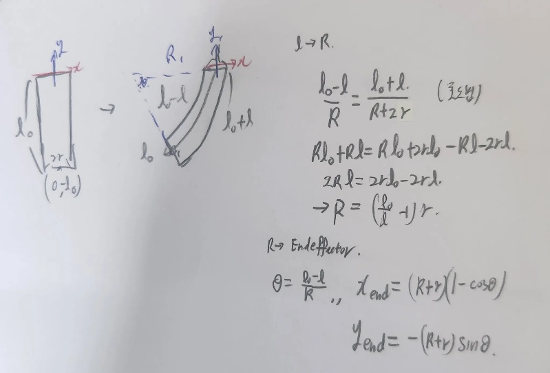<br/><em>그림 1. Arc geometry 기반 end-effector 좌표 계산 구상</em></p>

그러나 wire length는 motor 회전량과 선형으로 대응하지 않는다. 로봇이 휠 때 wire는 원호 구간과 비스듬한
빗변 구간을 함께 이동하며, θ가 변하면 두 구간 길이가 모두 변하므로 전체 wire length는 θ에 대한 비선형
함수가 된다. MATLAB simulation에서도 bending angle이 커질수록 wire length가 증가하되 일정 기울기의
직선이 아닌 비선형 곡선으로 나타났다.

<p align="center">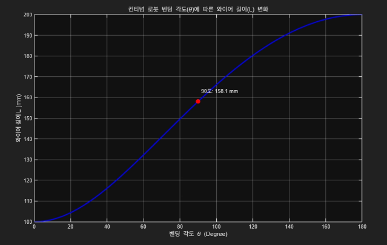<br/><em>그림 2. MATLAB Simulation으로 계산한 bending angle에 따른 wire length 변화</em></p>

이론적으로는 `target 좌표 → bending angle → wire length → motor position` 순으로 제어값을 도출할 수
있어 보였다. 그러나 실제로는 조립마다 비즈 와이어의 초기 길이와 장력이 달라지고 tendon channel 마찰,
출력물 유격, backbone 탄성 변형이 함께 작용하였으며, end-effector의 좌표나 laser point를 측정하는
센서가 없어 계산 좌표와 실제 위치의 오차를 보정할 수 없었다. 이에 따라 **표적별로 실제 레이저가 맞는
motor position을 실험적으로 찾는 calibration 방식**으로 전환하였다.

### 2.2 최종 제어 코드 구조 및 미션 운용 방식

최종 제어 코드는 target별 motor position을 **lookup table**로 저장하고, 미션 때 해당 값을 불러오는
calibration 구조로 구성하였다. 각 target에는 접근용 **approach position**과 실제 hit용 **final position**을
저장하였다. 전체 흐름은 아래 표와 같다.

**표 1. 최종 제어 코드 동작 방식 요약**

| 단계 | 동작 내용 |
|:---:|-----------|
| 1 | Dynamixel motor 연결 및 현재 position 확인 및 초기 자세로 이동 |
| 2 | 미션 번호 확인 및 table에서 해당 target의 approach/final position 불러오기 |
| 3 | approach position으로 이동 |
| 4 | final position으로 이동 |
| 5 | 목표 도달 여부 확인 (필요 시 teleoperation으로 motor position 미세 조정) |
| 6 | 보정된 값을 저장 후 차후 사용 |
| 7 | 다음 target으로 이동 후 반복 |

표적이 맞지 않을 경우에는 teleoperation으로 motor position을 미세 조정하고, 수정된 값을 calibration
file에 저장하여 이후 실행에서 다시 사용할 수 있도록 하였다. 이는 완전 자동 제어가 아닌
**semi-teleoperation**이지만, feedback이 없는 상황에서 오차에 대응하기 위해 사용하였다.

### 2.3 Minimum jerk profile 기반 motor position 보간

목표 position을 motor에 바로 입력하면 tendon이 순간적으로 당겨져 유연한 continuum body 끝단에 진동이
생길 수 있다. 따라서 minimum jerk profile은 end-effector의 Cartesian trajectory planning이 아니라,
현재 motor position과 목표 position 사이를 여러 단계로 나눠 부드럽게 잇는 **motor position smoothing**
목적으로 적용하였다.

<p align="center">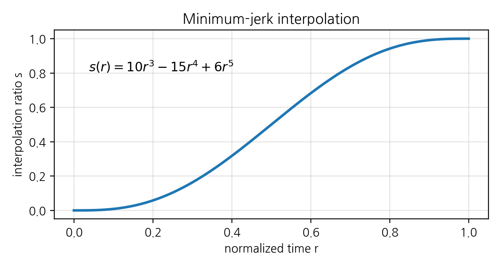<br/><em>그림 3. Minimum jerk 기반 motor position smoothing</em></p>

본 프로젝트에서 사용한 minimum jerk 보간은 다음과 같다.

```
s(τ) = 10τ³ − 15τ⁴ + 6τ⁵          (τ = t / T,  0 ≤ τ ≤ 1)
q(t) = q_start + (q_goal − q_start) · s(τ)
```

(τ: 전체 이동 시간 T에 대해 정규화된 시간, q: motor position, s: 0→1로 변하는 minimum jerk 보간 함수.
s(0)=0, s(1)=1, 시작·끝 속도/가속도가 0이 되어 부드럽게 정지·출발한다.) 구현은
[`trajectory.py`](calisavedontinuum_dobot2/trajectory.py)의 `minimum_jerk_scalar(r)`이며,
[`controller.py`](calisavedontinuum_dobot2/controller.py)의 `move_to_position_smooth()`에서 매 step 호출한다.

### 2.4 SMA brake의 변화

Continuum robot은 tendon 장력으로 형상이 만들어지므로 외력이나 wire 풀림에 자세가 흐트러질 수 있어
형상 고정용 brake가 필요하다. 초기 구조는 bead wire를 한쪽 방향에서만 걸어주는 방식이어서, 한 방향은
어느 정도 고정되었지만 반대 방향에서는 slack과 backlash로 완전히 고정되지 않았다. 이를 해결하기 위해
**ring gear, sun gear, planet gear**로 구성된 유성기어 구조를 적용하였다.

<p align="center">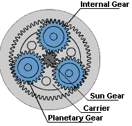<br/><em>그림 4. 유성 기어 구조</em></p>

ring gear와 sun gear가 반대 방향으로 연동되면 각 기어에 연결된 bead holder가 서로 다른 방향에서 wire를
잡고, planet gear가 둘의 맞물림을 유지하며 상대 운동을 만들어 좁은 공간에서도 양방향 걸림 구조를
형성한다. 설계 과정에서 planet gear 중심 체결부 공차로 회전이 매끄럽지 않거나 부품이 떠오르는 문제가
있어 gear hole과 offset 값을 조정하였으며, 최종적으로 **hole 2.3 mm, offset 0.07 mm** 조건을 적용하였다.

<p align="center">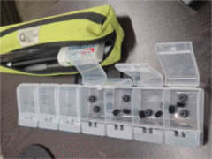<br/><em>그림 5. Gear hole 및 offset 조합 테스트</em></p>

또한 bead holder에 fillet을 추가하고 base와의 하부 간섭부를 수정하여, sun gear 측과 ring gear 측 bead
holder가 bead wire를 위·아래에서 거는 양방향 걸림 구조로 배치하였다. 제작은 3D 프린트로 하였고 기본
PLA 필라멘트를 사용하였다.

## 3. 결과

### 3.1 calibration 전후 반복 재현성

본 재현성 실험은 정렬 후 모터 position 1048~1998 enc까지의 값을 50 enc 간격으로 target을 설정 후
50번 반복 제어하여 나타난 평균 결과이다. 미션상 반복 제어를 해야 했기에 cycle에 따른 오차까지
측정하였다. Input보다 motor position이 더 많이 움직였기에, Calibration offset은 최대 오차인 +50 enc보다
조금 보수적인 **−65 enc** 정도를 추가하여 실험을 진행하였다.

<p align="center">
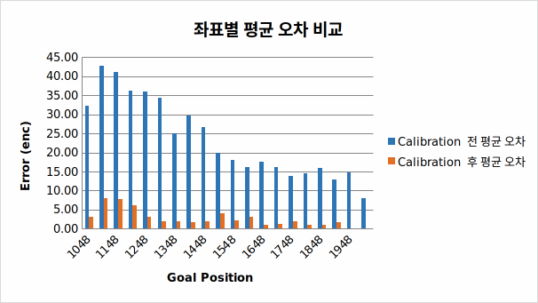
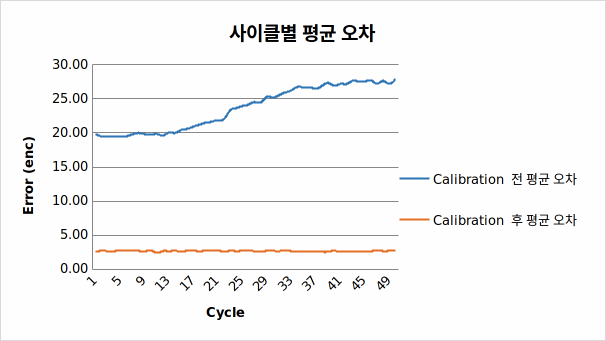<br/>
<em>그림 6. Position당 Calibration 전후 평균 오차 (좌) · 그림 7. 50 cycle Calibration 전후 평균 오차 (우)</em>
</p>

(여기서 cycle은 1048~1998 enc까지의 반복을 1 cycle 기준으로 하였다.)

### 3.2 SMA Brake

<p align="center">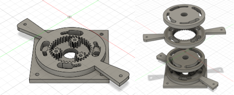<br/><em>그림 8. 최종 브레이크 형태</em></p>

**표 2. 미션 최종 결과**

| 미션 | 결과 |
|------|------|
| Continuum 제어 미션 | Target hit: **16개 / 1 min** |
| SMA 브레이크 미션 | **1.85 kg + 쇠구슬 30개** 하중 지지 |

그러나 브레이크의 경우 하중 인가 후 브레이크 부품 일부 변형 및 와이어 끼임이 발생하여 SMA가 브레이크를
해제하지 못하는 문제가 발생했다.

<p align="center">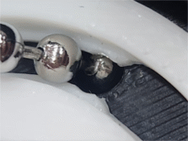<br/><em>그림 9. 미션 수행 당일 변형된 브레이크 구조</em></p>

## 4. 결론

제어 측면에서는 calibration 후 반복 재현성이 향상되는 경향을 확인하였다. calibration 전에는 평균적으로
20~30 enc 전후의 오차가 났으나 calibration 이후에는 한 자리 수 대의 오차를 보였으며, 반복 사이클
이후에도 calibration 전에는 평균 오차가 누적되어 증가하나 calibration 후에는 한 자리 수 대로 보정되는
효과를 보였다. 이는 정확한 forward kinematics가 정의되지 않고 축을 명확히 설정하지 못한 상황에서도,
하드웨어에서 실제 재현되는 motor position을 calibration 값으로 저장하면 재현성을 높일 수 있으며 이때
calibration이 반드시 필요함을 보여준다.

다만 미션 초기에 기준 자세를 맞추고 target별 calibration을 확인하는 데 전체 1분 중 약 10초가 소모되어
미션 효율을 낮췄다. 향후 Arduino와 pyserial로 target hit 여부를 Python으로 입력받으면, 매번 enter 없이
hit 신호 기준으로 다음 target으로 넘어가 더 자동화할 수 있고 calibration 시간도 줄일 수 있다. 또한
**ArUco marker 기반 position feedback**도 고려할 수 있다. 현재는 laser point나 end-effector 위치를
직접 측정하지 못해 육안과 소리에 의존했으나, 표적판이나 기준 프레임에 ArUco marker를 부착해 camera로
pose를 인식하면 vision feedback으로 확장할 수 있다.

brake 실험에서는 1.85 kg과 쇠구슬 30개 조건의 하중을 지지하였으나, 하중 인가 후 부품 일부가 변형되며
bead wire가 brake 내부에 끼였고, 그 결과 SMA에 전류를 인가해도 brake가 풀리지 않았다. 즉 brake의 문제는
단순히 하중을 버티는지 여부가 아니라, 하중을 받은 뒤에도 wire가 끼이지 않고 다시 해제될 수 있는지까지
포함하는 문제였다. 이 문제를 확인한 뒤 Fusion 360에서 소재 조건을 변경하여 미션 당일 무게(약 2.7 kg)
조건으로 추가 해석을 수행하였다. 비교군은 기본 PLA, PPA-CF, PA6-CF를 사용하였다.

<p align="center">
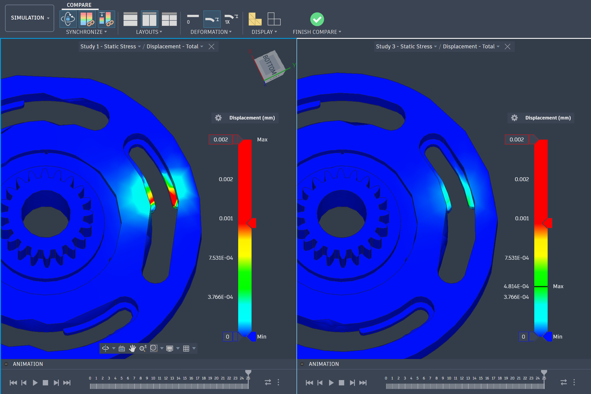
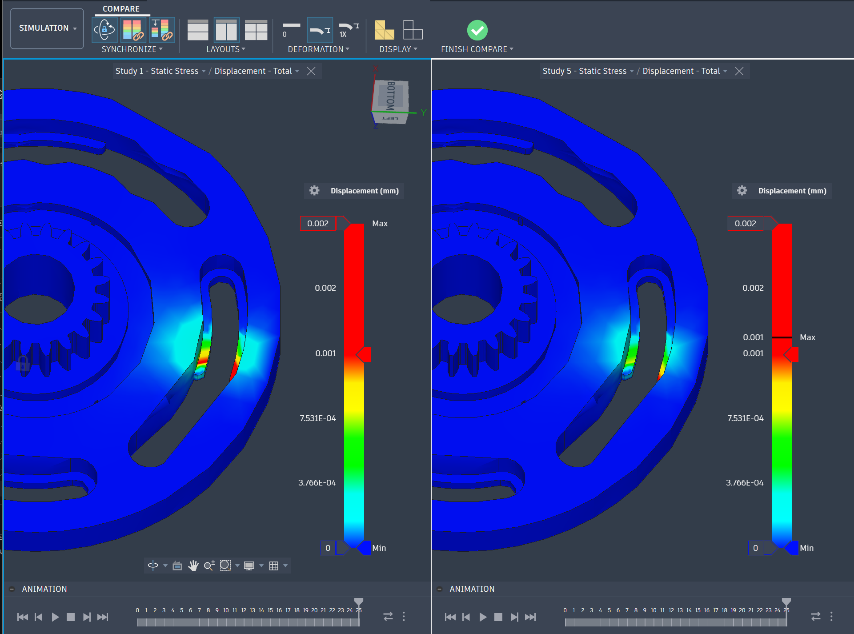<br/>
<em>그림 10. 기본 PLA(좌), PPA-CF(우) · 그림 11. 기본 PLA(좌), PA6-CF(우)</em>
</p>

**표 3. Fusion 360 해석 색상-변형량**

| 색상 | 변형량 (mm) |
|------|-------------|
| 빨간색 | 0.002 ~ 0.001 |
| 노란색 | 0.001 ~ 7.53×10⁻⁴ |
| 연두색 | 7.53×10⁻⁴ ~ 3.766×10⁻⁴ |
| 하늘색~파란색 | 3.766×10⁻⁴ ~ 0 |

해석 결과, 기존 출력 소재(PLA)보다 강성이 높은 소재(PA6-CF, PPA-CF)의 변형량이 감소하거나 크게
변형되는 범위가 줄어드는 경향을 확인하였다. 따라서 향후에는 강성이 높은 소재를 적용하여 하중 후 변형을
줄이는 방향으로 개선할 필요가 있다.

종합하면, 본 프로젝트를 통해 제어 측면에서는 calibration 기반 반복 재현성 확보의 중요성을 확인하였고,
brake 측면에서는 하중 지지와 해제 안정성을 동시에 고려해야 한다는 점을 확인하였다. 향후 pyserial 기반
feedback, ArUco marker 기반 position feedback, brake 소재 및 출력 조건 개선을 적용한다면 보다
자동화되고 반복 재현성이 높은 continuum robot 시스템으로 발전시킬 수 있을 것이다.

## 5. 코드 구조 및 실행

```
calisavedontinuum_dobot2/        # 최종 제어 코드
├── main.py                # 진입점: 연결 확인 → 초기 자세 → 미션 실행
├── mission.py             # run_mission_sequence: calibration lookup + 2단계 이동 + teleop 보정 저장
├── controller.py          # ContinuumController (Dynamixel SDK low-level wrapper, minimum-jerk smooth move)
├── continumm_controller.py# (대안) Dynamixel Easy SDK 기반 controller — 메인 흐름 미사용
├── calibration.py         # TARGET_TABLE / TRANSITION_TABLE (lookup table, 실행 중 갱신·저장)
├── config.py              # SCENARIO_TEXT, MOTOR_NUM, 포트/속도/타이밍 등 설정
├── trajectory.py          # minimum_jerk_scalar(r) = 10r³−15r⁴+6r⁵
├── scenario.py            # parse_scenario(text) → target 시퀀스
├── teleop_calibration.py  # 키보드 teleop으로 TARGET/TRANSITION_TABLE 생성·보정 도구
├── reboot_motor.py        # 모터 리부트 진단 스크립트
├── check_sdk.py           # 하드웨어 상태 점검 스크립트
├── CALIBRATION_TABLE_GUIDE.md
└── TELEOP_CALIBRATION_GUIDE.md

legacy/continuum_mission/        # 이전(legacy) 미션 버전 (continuum_mission.zip)
```

**실행**

```bash
cd calisavedontinuum_dobot2
python3 main.py            # config.py의 SCENARIO_TEXT로 미션 실행

# 새 target/transition 위치를 잡고 calibration table을 만들 때:
python3 teleop_calibration.py
```

> 모터 포트/baudrate/ID와 시나리오(`SCENARIO_TEXT`)는 [`config.py`](calisavedontinuum_dobot2/config.py)에서,
> target별 approach/final position은 [`calibration.py`](calisavedontinuum_dobot2/calibration.py)에서 관리합니다.

## 6. 코드 흐름 그래프

> 아래 Mermaid 다이어그램은 GitHub에서 바로 렌더링됩니다. 동일한 흐름을 **Obsidian Graph View**로도
> 볼 수 있도록 [`code-flow/`](code-flow) 폴더에 Vault를 만들어 두었습니다 — Obsidian에서
> *Open folder as vault* 후 Graph View(Ctrl/Cmd+G)를 켜세요.

### 6.1 모듈 의존 관계

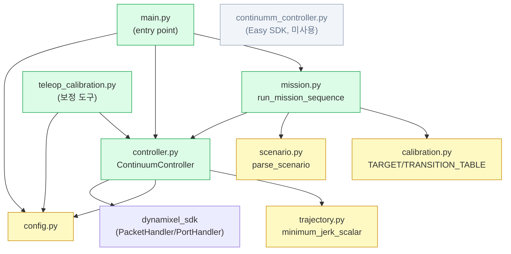

### 6.2 미션 실행 흐름

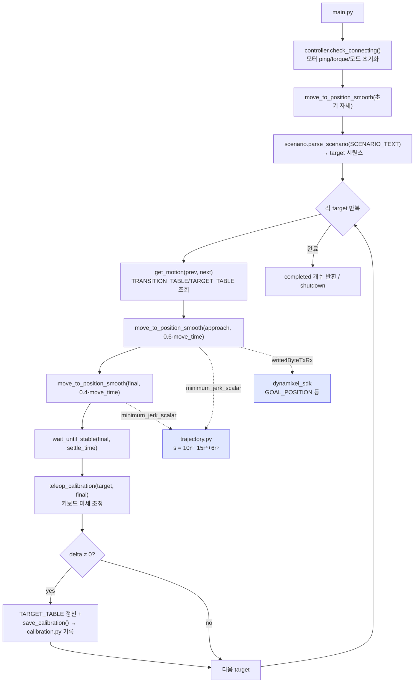

### 6.3 흐름 설명

1. **진입점 (`main.py`)** — `rclpy.init()` 후 `ContinuumController`를 생성하고 `check_connecting()`으로
   모든 모터를 ping → torque on → position mode → profile 설정한다. 이어 초기 자세로
   `move_to_position_smooth()` 이동한다.
2. **시나리오 파싱 (`scenario.parse_scenario`)** — `config.SCENARIO_TEXT`(예: `"1-2-3-..."`)를 target 번호
   리스트로 변환한다(target은 1·2·3).
3. **미션 루프 (`mission.run_mission_sequence`)** — 각 target에 대해
   - `get_motion(prev, next)` — `TRANSITION_TABLE`(전이별 override) 또는 `TARGET_TABLE`에서
     `{approach, final, move_time, settle_time}`을 조회한다(`calibration.py` lookup table).
   - **approach 이동** → **final 이동** 두 단계로 `move_to_position_smooth()` 호출. 이 함수는 매 step마다
     `trajectory.minimum_jerk_scalar(r)`(`10r³−15r⁴+6r⁵`)로 현재→목표 position을 부드럽게 보간하고
     `_write_goal_position_with_recovery()`로 Dynamixel `GOAL_POSITION`에 기록한다(하드웨어 alert 시 reboot 복구).
   - `wait_until_stable()`로 정착을 확인한 뒤, **teleop_calibration()** 으로 표적이 안 맞으면 키보드로
     motor position을 미세 조정한다(semi-teleoperation).
   - 보정 delta가 있으면 `TARGET_TABLE`을 갱신하고 `save_calibration()`으로 `calibration.py`에 다시 기록해
     이후 실행에서 재사용한다.
4. **종료** — 완료 target 개수를 반환하고 `shutdown()`으로 torque를 끄고 포트를 닫는다.

> **controller.py vs continumm_controller.py**: `controller.py`는 Dynamixel **SDK PacketHandler**를 직접
> 쓰는 저수준 wrapper로 메인 미션이 사용한다. `continumm_controller.py`는 Dynamixel **Easy SDK** 기반
> 대안 구현으로 메인 흐름에서는 사용하지 않는다.

---

## 참고문헌

1. Bishop, C., Russo, M., Dong, X., & Axinte, D. (2022). *A novel underactuated continuum robot with shape memory alloy clutches.* IEEE/ASME Transactions on Mechatronics, 27(6), 5339–5350. https://doi.org/10.1109/TMECH.2022.3179812
2. Fan, Y., Yi, B., & Liu, D. (2024). *An overview of stiffening approaches for continuum robots.* Robotics and Computer-Integrated Manufacturing, 90, 102811. https://doi.org/10.1016/j.rcim.2024.102811
3. Miida, H., et al. (2024). *Dish-shaped thin beads: A novel bead shape for wire-driven variable stiffness mechanisms.* 2024 IEEE RoboSoft (pp. 629–636). https://doi.org/10.1109/RoboSoft60065.2024.10522015
